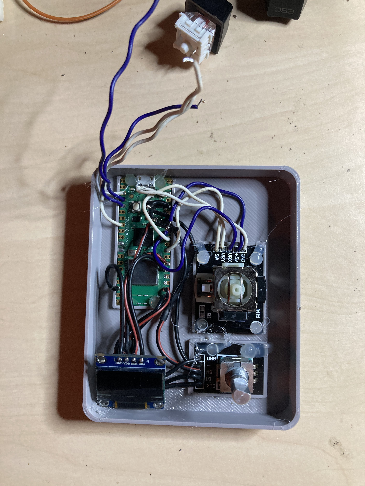
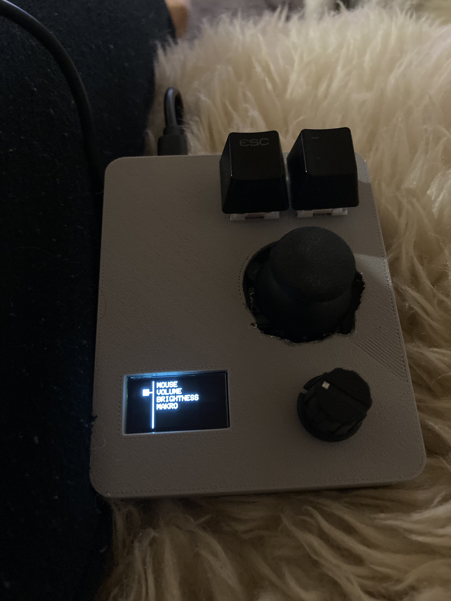

# Macro Mouse Pad RPI PICO

Raspberry PI Pico based Mouse pad using analog joystick, rotary encoder, keyboard switches and OLED display with menu for switching functionality

## Menu Control

- Mouse: mouse wheel with rotary encoder
- Volume: volume increment / decrement
- Brightness: Brightness control 